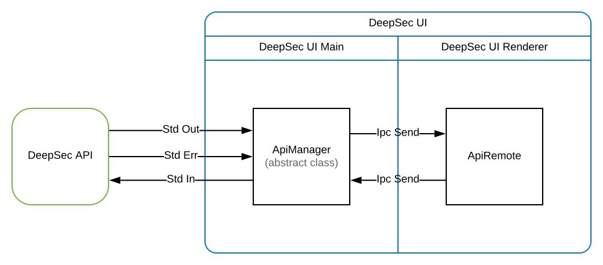

# Communications

## General

Some communication logic is implemented to call DeepSec API and receive answers.

Between the _DeepSec API_ process and _DeepSec UI Main_ process (which is Electron main process) the messages go through the standard output, input and error channel. All of this using the [spawn](https://nodejs.org/api/child_process.html) interface (from nodejs).

Between _DeepSec UI Main_ process and _DeepSec UI Renderer_ processes the messages go through [IPC](https://electronjs.org/docs/api/ipc-main) tool (from Electron).

## Internal

This part is wrapped by 2 classes _ApiManager_ on Main process and _ApiRemote_ on renderer process.

