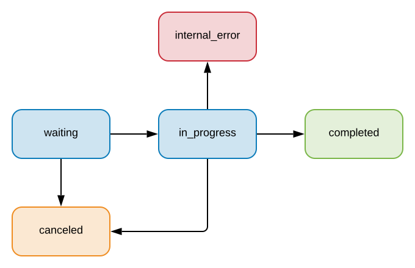

# Query Result

See [query result mock-data completed](../../mock-data/run/query_completed.json) or
[query result mock-data in progress](../../mock-data/run/query_in_progress.json) for examples.

## Status flow



## File

`batch_folder` and `batch_file` have the same name.

## Definition of `<query_result>`:

### Waiting

```
{
  "status": "waiting",
  "index": <int>, // Starting from 1
  "batch_file": "batch_file.json",
  "run_file": "batch_folder/run_file.json"
  "atomic_data": <atomic_data>,
  "semantics": <string>, // "private" | "classic" | "eavesdrop"
  "type": <string>, // "trace_equiv" | "trace_incl" | "observational_equiv" | "session_equiv" | "session_incl"
  "processes": [
    <process>,
    ...
    <process>
  ],
}
```

### In Progress

waiting +
```
{
  "status": "in_progress",
  ...
  "start_time": <int>, // Timestamp
  "progression": {
     "round": <int>, // Single core = 0
     "verification": {
       "percent": <int>, // 0-100
       "jobs_remaining": <int>
     },
     "generation": {
       "minimum_jobs": <int>,
       "jobs_created": <int>
     }
     // Can have either verification or generation but not both at the same time.
  }
}
```

### Canceled

waiting +
```
{
  "status": "canceled",
  ...
  "start_time": <int> (optional), // Timestamp. Not defined if the query was canceled before to start
  "end_time": <int>, // Timestamp. When is has been canceled
  // (Optional) No progression if canceled before to start
  "progression": {
     "round": <int>, // Single core = 0
     "verification": {
       "percent": <int>, // 0-100
       "jobs_remaining": <int>
     },
     "generation": {
       "minimum_jobs": <int>,
       "jobs_created": <int>
     }
     // Can have either verification or generation but not both at the same time.
  }
}
```

### Internal Error

waiting +
```
{
  "status": "internal_error",
  ...
  "start_time": <int>, // Timestamp
  "end_time": <int>, // Timestamp. When the error occurs
  "error_msg": <string>,
  // (Optional) No progression if error before to start
  "progression": {
     "round": <int>, // Single core = 0
     "verification": {
       "percent": <int>, // 0-100
       "jobs_remaining": <int>
     },
     "generation": {
       "minimum_jobs": <int>,
       "jobs_created": <int>
     }
     // Can have either verification or generation but not both at the same time.
  }
}
```

### Completed

waiting +
```
{
  "status": "completed",
  ...
  "start_time": <int>, // Timestamp
  "end_time": <int>, // Timestamp
  "memory": <int>, // The maximum memory used by OCaml during the running time of this query (in Byte)
  "attack_trace": {
    "index_process": <int>, // In process array (starting from 1)
    "action_sequence": [
      <action>,
      ...
      <action>
    ]
  } (optional) // If not defined then the query is verified.
}
```
